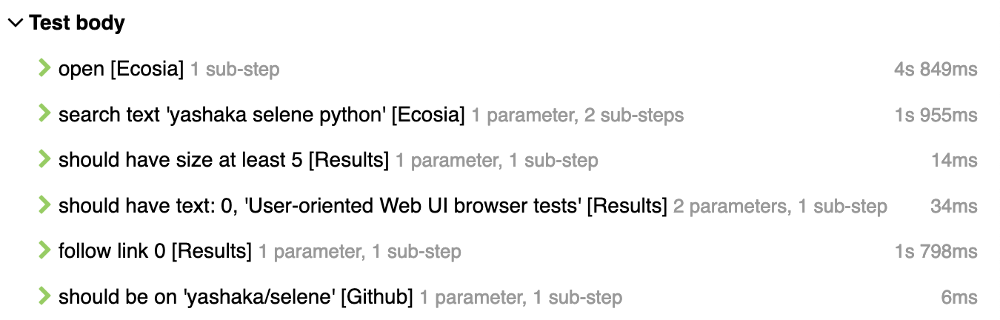
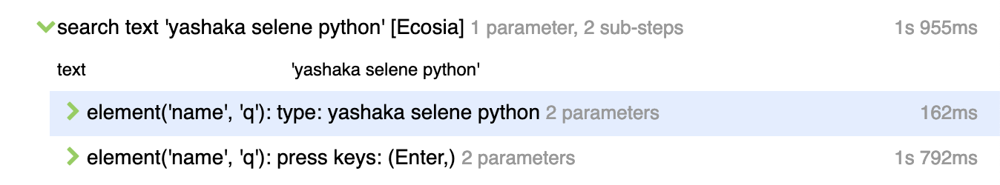

Selene + Pytest tests project template
======================================

Overview and general guidelines
-------------------------------

This is a template project. It's supposed to be cloned or downloaded and edited according to your needs.

The project itself reflects an implementation of acceptance web ui tests for a "web", i.e. as "application under test" we consider here the "whole web", under "root pages" we mean "web sites", under "sub-pages" we mean "web site pages". Take this into account when applying the template to your context;)

Hence, download it, rename the project folder to something like ``my-product-test``, then rename the modules correspondingly (like ``web_test`` to ``my_product_test``, etc...), edit the "project" section in ``pyproject.toml`` to something like::

    [tool.poetry]
    name = "my-product-test"
    version = "0.1.0"
    description = "my product web ui acceptance tests"
    authors = ["Your Name <your.name@yourcompanymailbox.com>"]

    ...

And you should be ready to go ;)

You can also consider keeping the template examples for some time. Maybe just leave ``web_test`` package as it is, and add your own ``my_product_test`` module. Then duplicate the ``tests`` folder, edit the copy as you need, while keeping the original ``tests`` folder under another name, e.g. ``examples``;)

Pay attention to a lot of comments and docstrings in code to understand what happens. You will find different styles of implementing page-objects. Probably you will need only one style in your case. So read all explanations and choose the one that fits your needs.

Installation
------------

Given installed:

* `pyenv + python <https://github.com/pyenv/pyenv>`_
* `poetry <https://poetry.eustace.io/docs/#installation>`_
* `allure <https://docs.qameta.io/allure/#_installing_a_commandline>`_

Clone template with ``git clone``

Do in your favourite terminal::

    cd $YOUR_PROJECT_FOLDER_PATH
    poetry install
    poetry shell

So you can run your tests via::

    pytest tests/

The `./run <https://github.com/yashaka/python-web-test/tree/master/run>`_ folder contains a bunch shell scripts as examples of different variations of running tests and other tasks, like setting selenoid up & running. To make them runnable do in your unix terminal inside ``$YOUR_PROJECT_FOLDER_PATH`` ::

    chmod -R u+x run

Now you can do something like::

    ./run/tests_and_reserve_report.sh

or even passing additional args, for example to filter only tests marked as "smoke"::

    ./run/tests_and_reserve_report.sh -m smoke

Some scripts expects at least one argument, like in this example::

    ./run/tests_marked_by.sh smoke

Or this::

    ./run/tests_remote_on.sh http://127.0.0.1:4444/wd/hub

Some needs docker and docker-compose to be preinstalled, so you can pull all needed browser images::

    ./run/pull_docker_images_for_selenoid_browsers.sh

And get selenoid up and running::

    ./run/start_up/selenoid_with_ui.sh

You might want to check corresponding `etc/selenoid/compose.yaml <https://github.com/yashaka/python-web-test/blob/master/etc/selenoid/compose.yaml>`_ docker-dompose file and tune it to your needs.

Check all scripts to see more examples of the framework usage, tune and remove not needed ones, according to your needs.

So you are ready to go;)
Feel free to use your editor of choice to surf the code base, and tune it correspondingly.

Details
-------

Features supported:

* parallel execution via pytest-xdist

* closer integration of pytest markers and allure

  * rerun tests via pytest-rerunfailures

* project configuration management by pydantic

  * local and remote webdriver management

* allure report

  * example of reported test case in straightforward/PageObejctLess style

    * code::

        def test_duckduckgo():
            browser.open('https://duckduckgo.com/')

            browser.element('[name=q]')\
                .should(be.blank)\
                .type('yashaka selene python').press_enter()
            browser.all('.result__body') \
                .should(have.size_greater_than(5)) \
                .first.should(have.text('User-oriented Web UI browser tests'))

            browser.all('.result__body').first.element('a').click()
            browser.should(have.title_containing('yashaka/selene'))

    * reported test body
        |allure-report-straightforward-test-body|

  * example of reported test case with PageObejcts

    * code::

        def test_ecosia():
            ecosia.open()

            ecosia.search('selene python')
            ecosia.results\
                .should_have_size_at_least(5)\
                .should_have_text(0, 'User-oriented Web UI browser tests')

            ecosia.results.follow_link(0)
            github.should_be_on('yashaka/selene')

    * reported

      * test body
        |allure-report-pageobjects-test-body|

      * sub-steps
        |allure-report-pageobjects-test-body-sub-steps|

  * reporting steps with automatic rendering of

    * underscores to spaces
    * inline params
    * context of step-function (object, class or module)
    * actions on raw selene elements

  * last screenshot and page-source are attached to test body on failure

  * use allure webserver to see reports with webui::

        allure serve reports

More resources and useful links
--------------------------

- `Pytest basic patterns and examples <https://docs.pytest.org/en/latest/example/simple.html>`_

TODO list
---------

This template is yet in progress. See `opened issues <https://github.com/yashaka/python-web-test/issues/>`_ for all todos.

.. |allure-report-straightforward-test-body| image:: ./docs/resources/allure-report-straightforward-test-body.png
