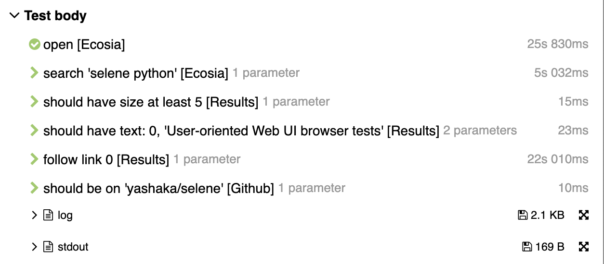

Selene + Pytest tests project template
======================================

Overview and general guidelines
-------------------------------

This is a template project. It's supposed to be cloned or downloaded and edited according to your needs.

The project itself reflects an implementation of acceptance web ui tests for a "web", i.e. as "application under test" we consider here the "whole web", under "root pages" we mean "web sites", under "sub-pages" we mean "web site pages". To apply this template to your context, usually you would need to rename all "web" entries in names or some option values in config files (like ``pyproject.toml``) to "your_project_name" with the following exceptions:

- you can rename ``web.py`` to ``app.py`` instead of ``your_project_name.py`` for conciseness
- you can use dashes instead of underscore in the project root folder
  - for example: ``your-project-name`` over ``your_project_name``

Hence, download it, rename the project folder to something like ``my-product-test``, then rename the modules correspondingly (like ``web_test`` to ``my_product_test``, etc...), edit the "project" section in ``pyproject.toml`` to something like::

    [tool.poetry]
    name = "my-product-test"
    version = "0.1.0"
    description = "my product web ui acceptance tests"
    authors = ["Your Name <your.name@yourcompanymailbox.com>"]

    ...

And you should be ready to go ;)

You can also consider keeping the template examples for some time. Maybe just leave ``web_test`` package as it is, and add your own ``my_product_test`` module. Then duplicate the ``tests`` folder, edit the copy as you need, while keeping the original ``tests`` folder under another name, e.g. ``examples``;)

Pay attention to a lot of comments and docstrings in code to understand what happens. You will find different styles of implementing page-objects. Probably you will need only one style in your case. So read all explanations and choose the one that fits your needs.

If you are a total beginner and like "simplest" way, consider using the style used in ``test_searchencrypt()``. If you are a beginner but want your project to "shine" and avoid "weird questions" from some senior engineers, use the style used in ``test_google()`` (other styles can be added afterwards).

Installation
------------

Given installed:

* `pyenv + python <https://github.com/pyenv/pyenv>`_
* `poetry <https://poetry.eustace.io/docs/#installation>`_
* `allure <https://docs.qameta.io/allure/#_installing_a_commandline>`_

Do in your favourite terminal::

    cd $YOUR_PROJECT_FOLDER_PATH
    poetry install
    poetry shell

So you can run your tests via::

    pytest tests/

Or with xdist parallelisation::

    pytest -n 4 tests/

Or with allure reports generated::

    pytest --alluredir=reports tests/

Details
-------

Features supported:

* allure report

  * example of reported test case

    * code::

        def test_ecosia():
            ecosia.open()

            ecosia.search('selene python')
            ecosia.results\
                .should_have_size_at_least(5)\
                .should_have_text(0, 'User-oriented Web UI browser tests')

            ecosia.results.follow_link(0)
            github.should_be_on('yashaka/selene')

    * reported test body
        |allure-report-test-body|

  * reporting steps with automatic rendering of

    * underscores to spaces
    * inline params
    * context of step-function (object, class or module)

  * last screenshot and page-source are attached to test body on failure

* parallel execution via xdist
* PageObjects examples of different styles

  * simple pageobjects (1 pageobject per page)
  * more granular pageobjects (>1 pageobject per page)
  * fluent pageobjects (pageobject step return object of next page or component on the page)
  * page-modules (simple python module with functions instead of class with methods)
  * one root entry point to all pageobjects (aka application manager)

tbd

More examples
.............

Running a single "test case" with allure report generated::

    pytest --alluredir=reports tests/test_search_engines_should_search.py::test_google

Resources and useful links
--------------------------

- `Pytest basic patterns and examples <https://docs.pytest.org/en/latest/example/simple.htm>`_

TODO list
---------

This template is yet in progress. **Todos** are:

- add support for parsing command line args
- read options from env files
- more default options examples, like headless mode for browser
- allure reporting integrated

  - log low level selene actions via corresponding selene hooks

- test suites via pytest marks/tags

  - `allure integration <https://docs.qameta.io/allure/#_tags>`_

- rerun failures

  - `pytest+allure retries <https://docs.qameta.io/allure/#_retries>`_

- document allure's history vs retries usage

- desired

  - headless mode
  - optional screenshots on passed test too
  - optional screenshots on each step
  - widgets example
  - jenkinsfile
  - multi-browser support with selenoid

